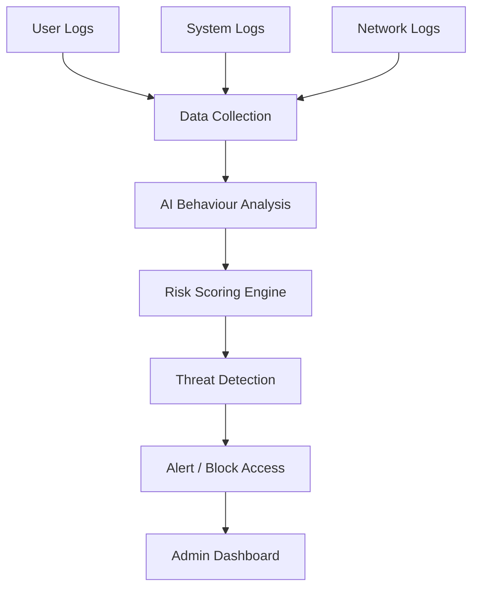

# 🛡️ PrivGuard

**AI-Driven Privileged Access Misuse & Insider Threat Detection Platform**

PrivGuard is a real-time insider threat detection engine that combines **User & Entity Behavior Analytics (UEBA)**, **rule-based scoring**, **graph-based identity analysis**, and **post-quantum cryptography (PQC)** to detect and respond to privileged access misuse in enterprise environments.

---

## 🏗️ Architecture Overview



---

## ✨ Key Features

| Feature | Description |
|---|---|
| **Real-time Event Ingestion** | FastAPI-powered REST API for streaming security events |
| **UEBA / Anomaly Detection** | Isolation Forest ML model trained on behavioral baselines |
| **Composite Risk Scoring** | Weighted multi-signal fusion (rules + ML + graph context) |
| **Adaptive Response Actions** | Auto-routing: Allow → Step-up MFA → JIT Approval → Session Block |
| **Identity Graph Engine** | Neo4j-backed privilege escalation path analysis |
| **Post-Quantum Cryptography (QPC)** | Sensitive credentials secured using **CRYSTALS-Kyber (ML-KEM)** for key encapsulation and **CRYSTALS-Dilithium (ML-DSA)** / **Falcon** for digital signatures, protecting against future quantum attacks |
| **PostgreSQL Schema** | Production-grade relational model with RBAC, sessions, alerts & cases |

---

## 📁 Project Structure

```
PrivGuard/
├── app.py                      # FastAPI application & API routes
├── models.py                   # Pydantic request/response schemas
├── features.py                 # Rolling behavioral feature extractor (UEBA)
├── ml_models.py                # Isolation Forest anomaly detector
├── generate_synthetic_data.py  # Synthetic training data generator
├── pqc_crypto.py               # Post-Quantum Cryptography interfaces (ML-DSA/ML-KEM)
├── schema.sql                  # PostgreSQL DDL schema
├── graph_constraints.cypher    # Neo4j graph constraints & indexes
├── requirements.txt            # Python dependencies
├── .env.example                # Environment variable template
├── .gitignore                  # Git ignore rules
└── README.md                   # This file
```

---

## 🚀 Quick Start

### Prerequisites

- **Python** 3.10+
- **PostgreSQL** 14+ (optional, for full persistence)
- **Neo4j** 5.x (optional, for graph analysis)

### 1. Clone the Repository

```bash
git clone https://github.com/yukesh4349/Privguard.git
cd Privguard
```

### 2. Create a Virtual Environment

```bash
python -m venv venv

# Windows
venv\Scripts\activate

# macOS / Linux
source venv/bin/activate
```

### 3. Install Dependencies

```bash
pip install -r requirements.txt
```

### 4. Configure Environment Variables

```bash
cp .env.example .env
# Edit .env with your database credentials
```

### 5. Train the ML Model (Optional)

```bash
python generate_synthetic_data.py
```

### 6. Start the Server

```bash
python app.py
# Or with uvicorn directly:
uvicorn app:app --reload --host 0.0.0.0 --port 8000
```

The API will be available at `http://localhost:8000`

---

## 📡 API Endpoints

### `POST /api/v1/events/ingest`

Ingest a security event and receive a real-time risk assessment.

**Request Body:**
```json
{
  "event_id": "550e8400-e29b-41d4-a716-446655440000",
  "session_id": "6ba7b810-9dad-11d1-80b4-00c04fd430c8",
  "timestamp": "2026-07-15T02:30:00Z",
  "event_type": "export",
  "target_system": "prod-database-01",
  "target_object": "customers_pii_table",
  "bytes_transferred": 50000,
  "command_text": "SELECT * FROM customers",
  "result_status": "success"
}
```

**Response:**
```json
{
  "event_id": "550e8400-e29b-41d4-a716-446655440000",
  "composite_risk_score": 63.5,
  "risk_band": "High",
  "action_required": "jit-approval-required",
  "explanation": "Risk 63.5/100 - Anomaly Score: 45.0, Rule Score: 80.0. Action assigned based on High risk band."
}
```

### `GET /health`

Health check endpoint.

```json
{
  "status": "ok",
  "message": "Insider Threat Engine is running."
}
```

---

## 🔬 Risk Scoring Model

The composite risk score is calculated using a weighted fusion of multiple signals:

| Signal | Weight | Source |
|---|---|---|
| **Rule Engine** | 0.35 | Deterministic policy rules (e.g., large data exports) |
| **Anomaly Model (UEBA)** | 0.45 | Isolation Forest behavioral anomaly score |
| **Graph Context** | 0.20 | Neo4j privilege path analysis |

### Risk Bands & Actions

| Score Range | Risk Band | Automated Action |
|---|---|---|
| 0 – 30 | 🟢 Low | Allow |
| 31 – 60 | 🟡 Medium | Step-up MFA |
| 61 – 85 | 🟠 High | JIT Approval Required |
| 86 – 100 | 🔴 Critical | Auto-block Session |

---

## 🔐 Post-Quantum Cryptography

PrivGuard includes interfaces for NIST-standardized post-quantum algorithms:

- **ML-DSA (FIPS 204)** — Digital signatures for tamper-evident risk score logs
- **ML-KEM (FIPS 203)** — Key encapsulation for secure inter-service communication

> Currently using mock providers. Full integration with `liboqs` / `oqs-python` is planned.

---

## 🗄️ Database Schema

The PostgreSQL schema (`schema.sql`) includes:

- **User** — Identity and HR metadata
- **Account** — Privileged/standard/service accounts
- **Session** — Auth sessions with MFA tracking
- **Event** — Granular access events
- **Entitlement** — JIT privilege grants
- **RiskScoreLog** — PQC-signed risk score history
- **Alert** — Triggered security alerts
- **Case** — Analyst investigation cases
- **AssetCriticality** — System tiering and data classification

---

## 🛠️ Tech Stack

| Layer | Technology |
|---|---|
| API Framework | FastAPI + Uvicorn |
| ML / UEBA | scikit-learn (Isolation Forest) |
| Data Validation | Pydantic v2 |
| Relational DB | PostgreSQL + SQLAlchemy |
| Graph DB | Neo4j |
| PQC Crypto | ML-DSA / ML-KEM (NIST FIPS 203/204) |
| Data Processing | NumPy, Pandas |

---

## 📄 License

This project is developed for the **FinSpark Hackathon**.

---

## 👥 Authors

- **Yukesh** — [GitHub](https://github.com/yukesh4349)
