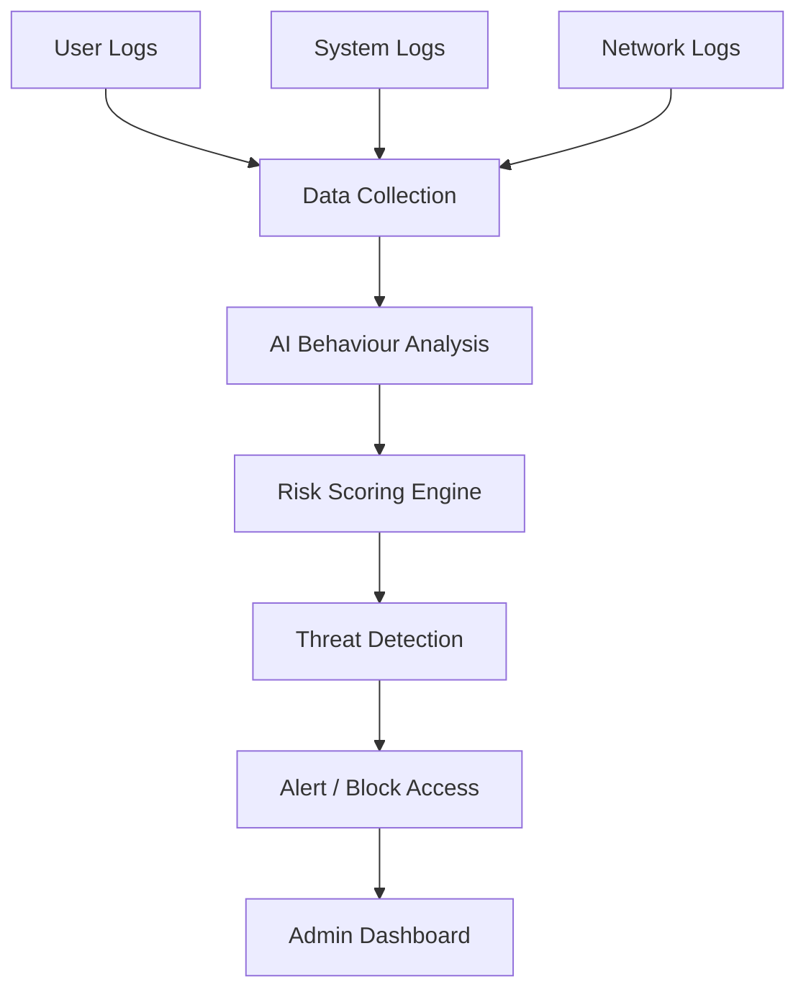

# PrivGuard Architecture & Threat Model

PrivGuard is a real-time insider threat detection engine. This document outlines the end-to-end architectural flow, the data pipeline, and the advanced security measures—specifically Post-Quantum Cryptography (PQC)—employed to secure the system against future threats.

## 1. End-to-End System Flow

The system continuously monitors privileged access and responds dynamically based on AI-driven risk analysis.

### Flow Breakdown
- **Data Collection**: Aggregates User Logs, System Logs, and Network Logs into a unified stream.
- **AI Behaviour Analysis**: Monitors user login behavior and detects abnormal activities using ML models.
- **Risk Scoring Engine**: Generates a dynamic composite risk score (0–100) based on anomaly scores, static rules, and identity graph context.
- **Threat Detection**: Evaluates the score against predefined thresholds.
- **Alert / Block Access**: Triggers the appropriate response router (e.g., Allow, Step-up MFA, JIT Approval, or Auto Block).
- **Admin Dashboard**: Provides real-time visibility into active threats and flagged users.

## 2. Technology Stack

### AI / Machine Learning
- **Language**: Python
- **Libraries**: Scikit-Learn
- **Models**:
  - Isolation Forest (UEBA & Anomaly Detection)
  - Random Forest (Classification - Planned)
  - XGBoost (Classification - Planned)

### Backend
- **Framework**: FastAPI / Flask
- **Role**: High-throughput event ingestion, orchestration, and API services.

### Dashboard / Frontend
- **Frameworks**: React, Streamlit (Alternative UI), Vanilla JS/HTML/CSS (Current Web App)

### Security Layers
- **MFA (OTP)**: Multi-Factor Authentication for medium-risk step-up challenges.
- **Role-Based Access Control**: Strict segregation between `admin` and `user` roles.
- **Quantum-Proof Cryptography (QPC)**: See Section 3.

## 3. Quantum-Proof Cryptography (QPC)

Future quantum computers may break today's standard encryption methods (like RSA and ECC) significantly faster. To ensure long-term data security, PrivGuard stores sensitive credentials and encrypts session payloads using **Quantum-Safe Encryption Libraries**.

PrivGuard utilizes the following stronger cryptographic algorithms:
- **CRYSTALS-Kyber (ML-KEM)**: Key Encapsulation Mechanism used to secure symmetric encryption keys.
- **CRYSTALS-Dilithium (ML-DSA)**: Digital Signature algorithm used to authenticate data and prevent tampering.
- **Falcon**: Additional fast-signature scheme for real-time authentication.

By integrating these next-generation algorithms, PrivGuard ensures that sensitive credentials and access logs remain secure even against "Store Now, Decrypt Later" quantum attacks.
